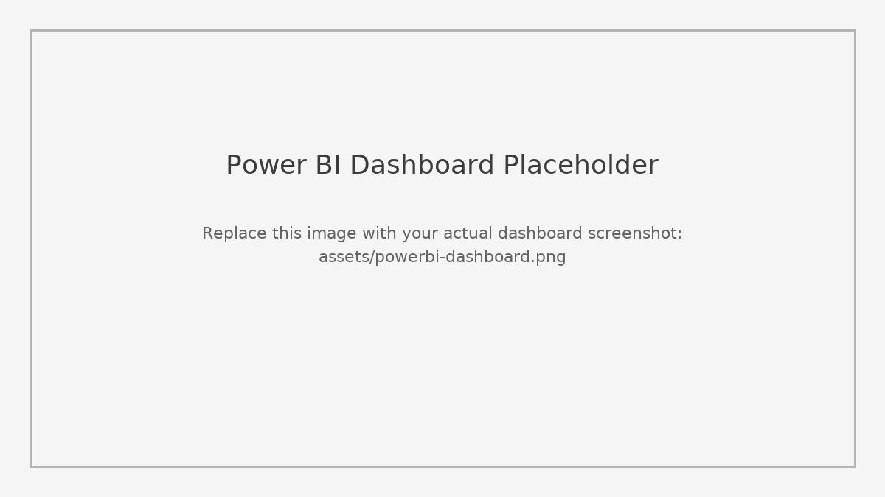

# Microsoft Power BI: Decision Methods and Modeling for Business Intelligence

This repository accompanies a write-up on **Business Intelligence (BI)** and **Power BI** with examples of data analysis and visualizations. It includes a structured README, proper references, and placeholders for your Power BI project file (`.pbix`) and dashboard image.

---

## What is Business Intelligence (BI)?
**Business Intelligence (BI)** involves using data from internal and external sources to gain insights and optimize business decisions and outcomes. BI aligns with strategic planning and helps organizations adapt to changing market conditions. By analyzing past and current data, teams can anticipate trends in operations and markets. These analyses are typically performed with specialized software tools.

## Data Analysis
**Data analysis** is the process of deriving insights from data—identifying patterns, evaluating cause–effect relationships, and making estimations using statistical and analytical methods. Once analysis is complete, communicating findings clearly and accurately is essential so stakeholders can take informed action.

## Data Visualizations
Effective visualizations—charts, graphs, maps, and dashboards—help translate complex information into digestible insights. Tools range from spreadsheet software (e.g., Microsoft Excel) to analytics platforms that produce interactive dashboards with infographics, gauges, geographic maps, sparklines, heatmaps, and more. Visualizations can clarify patterns and problems that may be difficult to detect in text-only formats.

## About Microsoft Power BI
**Microsoft Power BI** is a robust tool for interactive visualizations and in-depth analysis. It integrates with Microsoft services (e.g., Excel, SQL Server, Azure) and many third‑party data sources (e.g., Salesforce). Power BI supports building end‑to‑end analytics workflows and rich dashboards for business users.

### Dashboard Preview (add your image)
> Replace the placeholder image below by exporting or screenshotting your Power BI dashboard and saving it to `assets/powerbi-dashboard.png`.



---

## Repository Structure
```
powerbi-decision-methods-bi/
├── README.md
├── LICENSE
├── .gitignore
├── CITATION.cff
├── docs/
│   └── references.bib
├── assets/
│   └── powerbi-dashboard.png        # <- Replace with your actual dashboard image
├── powerbi/
│   └── YourDashboard.pbix           # <- Place your .pbix file here
└── data/
    └── README.md                    # <- Notes about any datasets (sources, licenses)
```

---

## How to Use This Repo

### 1) Add your Power BI file
- Export or save your Power BI Desktop file as: `powerbi/YourDashboard.pbix` (you can rename it).
- If the file is very large (> 100 MB), consider using Git LFS or sharing via a release asset or cloud link.

### 2) Add a dashboard image to the README
- Take a screenshot of the dashboard (or export visuals) and save it as:
  - `assets/powerbi-dashboard.png`
- The README is already set to display `assets/powerbi-dashboard.png` with a relative path.

### 3) (Optional) Add data and document sources
- Put any public datasets in `data/` and update `data/README.md` with source links and licenses.
- Add citation entries to `docs/references.bib` (BibTeX) and the **References** section below.

---

## References

- Microsoft. (n.d.). *Power BI—Data visualization*. Microsoft Power Platform. https://powerbi.microsoft.com/en-us/
- uCertify. (n.d.). *Award‑winning online learning platform*. https://www.ucertify.com/products/learn.html

> Note: Web pages without clear publication dates are cited as **(n.d.)** with the site owner as the author (e.g., Microsoft, uCertify). If you have the specific course or article titles/authors from uCertify, update the entry for precision.

---

## License
This project is licensed under the MIT License (see [LICENSE](LICENSE)).

## How to Cite
See `CITATION.cff` for a standard repository citation format.
